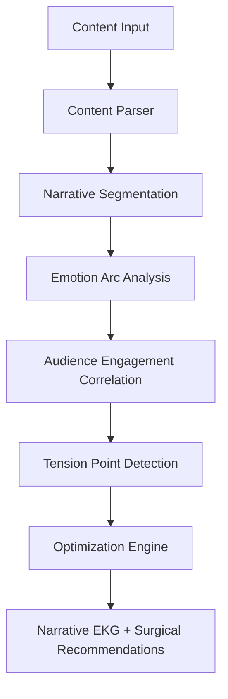

# EmotionArc Conductor

Narrative Tension Optimization System

Fixing the invisible reason behind 60% audience drop-off: emotional pacing.

## 📍Overview

EmotionArc Conductor is an AI-driven narrative analysis and optimization system designed to identify, diagnose, and surgically correct emotional pacing issues in long-form content.

Many creators feel something is wrong with their story’s flow but cannot pinpoint where, why, or how to fix it without rewriting everything. EmotionArc Conductor solves this by:

- Quantifying emotional intensity

- Correlating it with real audience engagement data

- Visualizing narrative flow as a Narrative EKG

- Delivering precise, timing-based surgical recommendations

This system is built for writers, screenwriters, game designers, educators, and digital content creators, with a special focus on data-driven storytelling for Indian and global audiences.

## 📍Problem Statement

Studies and platform analytics consistently show that up to 60% of audiences disengage due to poor emotional pacing, not poor content quality.

Key Challenges:

- Emotional fatigue from sustained intensity.

- Unearned emotional peaks.

- Long flat segments with no micro-tension.

- Misalignment between creator intent and audience response.

## 📍Solution

EmotionArc Conductor introduces a Narrative Intelligence Layer that:

- Analyzes emotional arcs across a story

- Aligns them with real or predicted audience behavior

- Detects pacing defects with mathematical precision

## 📍Core Concepts

### Term	Description
Emotion Arc	Trajectory of emotional intensity across the narrative
Narrative EKG	Visual “heartbeat” of emotional engagement
Tension Point	Significant emotional peak, valley, or transition
Unearned Peak	High intensity without sufficient buildup
Emotional Fatigue	Drop-off caused by prolonged intensity

## 📍Features

### Content Parsing

- Supports TXT, DOCX, PDF

- Preserves chapters, scenes, acts

- Separates dialogue and narration

- Handles documents up to 500,000+ words

### Emotional & Engagement Analysis

- Multi-dimensional emotion scoring (0–100)

Correlates with:

- Drop-off points

- Replay segments

- Interaction spikes

Detects:

- Unearned peaks

- Emotional fatigue zones

### Tension Point Detection

Identifies:

- Peaks

- Valleys

- Rapid transitions

- Measures spacing between emotional beats

- Flags long engagement-risk zones

### Surgical Pacing Recommendations

All recommendations are:

- Minimal

- Precise

- Backed by data + narrative theory

### Narrative EKG Visualization

- Emotional intensity as a heartbeat graph

- Engagement overlay (drop-offs, replays)

- Zoomable to frame-level detail

- Real-time updates with new data

### Comparative Version Analysis

- Compare drafts or revisions

- Track emotional improvement/degradation

- Measure recommendation impact

- Generate revision reports

### Engagement Data Integration

- YouTube Analytics

- Podcast analytics

- E-book reading behavior

- OTT / streaming patterns 

- Predictive modeling when data is missing

## 📍Target Users

- Long-form writers & novelists

- Screenwriters & filmmakers

- Game narrative designers

- Podcast & YouTube creators

- Writing instructors & editors

- Ed-tech and media startups

## 📍EmotionArc Conductor aligns strongly with AI for Bharat goals by:

- Democratizing advanced narrative intelligence tools

- Supporting Indian storytellers across languages & formats

- Enhancing digital education, entertainment, and media quality

- Enabling data-driven creativity for emerging creators

## 📍Future Scope

- Multilingual emotional models (Indian languages)

- Real-time feedback while writing

- Integration with GenAI story generation

- Adaptive pacing for different audience demographics

- Clinical validation for educational content engagement

## 📍Conclusion

EmotionArc Conductor provides a structured, data-driven approach to solving a well-known but poorly addressed problem in content creation: audience disengagement caused by improper emotional pacing. By combining narrative analysis with real audience engagement data, the system enables creators to identify exactly where emotional misalignment occurs and why it leads to drop-off.

The system moves beyond generic feedback by delivering precise, timing-based recommendations that can be implemented without major rewrites. Its ability to visualize emotional flow through the Narrative EKG, detect pacing defects such as emotional fatigue and unearned peaks, and continuously learn from engagement data makes it both practical and scalable.

EmotionArc Conductor is designed to integrate seamlessly into existing creative workflows and can be applied across multiple domains, including writing, education, digital media, and entertainment. With future extensions into multilingual and real-time analysis, the system has strong potential to support a wide range of creators, particularly in emerging digital ecosystems.

Overall, this project demonstrates how applied AI can translate abstract creative challenges into measurable insights and actionable improvements.

Micro-Tension Beat	Small engagement moments between major events
Surgical Recommendation	Precise timing-based content adjustment
