# EmotionArc Conductor - Design Document

## Overview

The EmotionArc Conductor is a narrative tension optimization system designed to solve the critical problem where content creators lose 60% of their audience due to emotional pacing issues. The system provides surgical recommendations with specific timing adjustments to optimize narrative flow through advanced emotional pattern analysis and audience engagement correlation.

## Architecture

### System Components

#### 1. Content Parser
**Purpose**: Extract and segment narrative content from various input formats
**Design Rationale**: Modular parser design allows for extensibility to new formats while maintaining consistent internal representation

- **Text Extraction Engine**: Handles TXT, DOCX, PDF formats with format-specific processors
- **Structural Analyzer**: Preserves chapter/scene boundaries and hierarchical structure
- **Dialogue Detector**: Uses NLP patterns to distinguish dialogue from narrative text
- **Content Segmenter**: Divides content into analyzable narrative segments while maintaining continuity
- **Chunking Manager**: Processes large content (>500k words) in manageable chunks

#### 2. Emotion Arc Analyzer
**Purpose**: Analyze emotional intensity patterns and correlate with audience engagement
**Design Rationale**: Multi-dimensional emotional analysis provides more nuanced insights than single-metric approaches

- **Emotional Intensity Calculator**: Assigns 0-100 scores across multiple emotional dimensions
- **Engagement Correlator**: Cross-references emotional patterns with audience behavior data
- **Pattern Detector**: Identifies emotional fatigue, unearned peaks, and engagement misalignments
- **Narrative EKG Generator**: Creates visual representations of emotional heartbeat patterns

#### 3. Optimization Engine
**Purpose**: Generate surgical recommendations for narrative improvements
**Design Rationale**: Surgical approach minimizes disruption to creative vision while maximizing audience retention

- **Tension Point Detector**: Identifies peaks, valleys, and transitions in emotional intensity
- **Pacing Analyzer**: Calculates optimal timing for story beats based on engagement patterns
- **Recommendation Generator**: Provides specific timing adjustments and content suggestions
- **Impact Predictor**: Estimates audience retention improvements for each recommendation

#### 4. Engagement Data Integrator
**Purpose**: Import and process audience analytics from multiple platforms
**Design Rationale**: Platform-agnostic design ensures broad compatibility and future extensibility

- **Platform Connectors**: APIs for YouTube, Netflix, podcast platforms, e-book readers
- **Data Normalizer**: Standardizes metrics across different platforms
- **Predictive Modeler**: Estimates audience behavior when direct data is unavailable
- **Learning Engine**: Continuously improves recommendations based on engagement outcomes

### Data Flow Architecture

```mermaid
flowchart TD
    %% Input Sources
    A1[📄 Text Files<br/>TXT, DOCX, PDF] --> B1[Content Parser]
    A2[📊 YouTube Analytics] --> B2[Engagement Data<br/>Integrator]
    A3[📺 Netflix Data] --> B2
    A4[🎧 Podcast Analytics] --> B2
    A5[📚 E-book Metrics] --> B2
    
    %% Processing Layer
    B1 --> C1[📝 Narrative Segments<br/>with Structure]
    B2 --> C2[📈 Normalized<br/>Engagement Data]
    
    %% Analysis Engine
    C1 --> D[🧠 Emotion Arc Analyzer]
    C2 --> D
    
    D --> E1[💓 Emotional Intensity<br/>Scores 0-100]
    D --> E2[📉 Drop-off Point<br/>Detection]
    D --> E3[⚡ Tension Point<br/>Identification]
    
    %% Optimization Layer
    E1 --> F[🎯 Optimization Engine]
    E2 --> F
    E3 --> F
    
    F --> G1[🔧 Surgical<br/>Recommendations]
    F --> G2[📊 Narrative EKG<br/>Visualization]
    F --> G3[📈 Impact<br/>Predictions]
    
    %% Output Layer
    G1 --> H1[✂️ Specific Timing<br/>Adjustments]
    G2 --> H2[💓 Interactive<br/>Heartbeat Charts]
    G3 --> H3[📊 Retention<br/>Improvement Metrics]
    
    %% Feedback Loop
    H1 -.-> I[📝 Content Updates]
    I -.-> A1
    H3 -.-> J[🔄 Learning Engine]
    J -.-> F
    
    %% Styling
    classDef inputNode fill:#e1f5fe,stroke:#01579b,stroke-width:2px
    classDef processNode fill:#f3e5f5,stroke:#4a148c,stroke-width:2px
    classDef analysisNode fill:#e8f5e8,stroke:#1b5e20,stroke-width:2px
    classDef outputNode fill:#fff3e0,stroke:#e65100,stroke-width:2px
    classDef feedbackNode fill:#fce4ec,stroke:#880e4f,stroke-width:2px
    
    class A1,A2,A3,A4,A5 inputNode
    class B1,B2,C1,C2 processNode
    class D,E1,E2,E3,F analysisNode
    class G1,G2,G3,H1,H2,H3 outputNode
    class I,J feedbackNode
```



#### Flow Description

**🔄 Input Phase**
- Multiple content formats processed through specialized parsers
- Engagement data normalized from various platforms
- Real-time data ingestion with batch processing capabilities

**🧠 Analysis Phase**
- Narrative segments analyzed for emotional patterns
- Cross-correlation with audience engagement metrics
- Multi-dimensional tension point detection

**🎯 Optimization Phase**
- Surgical recommendation generation with specific timing
- Interactive visualization creation
- Impact prediction modeling

**📊 Output Phase**
- Actionable recommendations with precise adjustments
- Visual narrative EKG for intuitive understanding
- Quantified improvement predictions

**🔄 Feedback Loop**
- Continuous learning from implementation results
- Model refinement based on real-world outcomes
- Iterative improvement of recommendation accuracy

## Core Algorithms

### Emotional Intensity Scoring
**Algorithm**: Multi-dimensional sentiment analysis with contextual weighting
- **Lexical Analysis**: Word-level emotional valence scoring
- **Contextual Modifiers**: Sentence structure and narrative context adjustments
- **Temporal Smoothing**: Moving averages to prevent noise in intensity calculations
- **Dimensional Scoring**: Separate scores for tension, excitement, sadness, fear, etc.

### Tension Point Detection
**Algorithm**: Peak detection with adaptive thresholds
- **Change Detection**: Identifies intensity changes >20 points within segments
- **Classification Logic**: Categorizes as peaks, valleys, or transitions
- **Rhythm Analysis**: Calculates distances between major tension points
- **Risk Assessment**: Flags extended periods without tension variation

### Surgical Recommendation Generation
**Algorithm**: Optimization-based approach with constraint satisfaction
- **Problem Identification**: Correlates drop-off points with emotional patterns
- **Solution Space**: Generates possible timing adjustments and content modifications
- **Impact Modeling**: Predicts audience retention improvements
- **Conflict Resolution**: Sequences recommendations to avoid overlapping changes

## Data Models

### Narrative Segment
```typescript
interface NarrativeSegment {
  id: string;
  content: string;
  startPosition: number;
  endPosition: number;
  segmentType: 'chapter' | 'scene' | 'paragraph' | 'timestamp';
  emotionalIntensity: EmotionalScore;
  engagementMetrics: EngagementData;
  structuralMetadata: StructuralInfo;
}
```

### Emotional Score
```typescript
interface EmotionalScore {
  overall: number; // 0-100
  dimensions: {
    tension: number;
    excitement: number;
    sadness: number;
    fear: number;
    joy: number;
    anger: number;
  };
  confidence: number; // 0-1
  timestamp: Date;
}
```

### Tension Point
```typescript
interface TensionPoint {
  id: string;
  position: number;
  type: 'peak' | 'valley' | 'transition';
  intensity: number;
  significance: number; // 0-1
  context: string;
  engagementImpact: number;
}
```

### Surgical Recommendation
```typescript
interface SurgicalRecommendation {
  id: string;
  type: 'move' | 'add' | 'modify' | 'remove';
  description: string;
  currentPosition: number;
  recommendedPosition: number;
  reasoning: string;
  expectedImpact: number; // predicted retention improvement
  priority: 'high' | 'medium' | 'low';
  conflictsWith: string[]; // other recommendation IDs
}
```

## User Interface Design

### Narrative EKG Visualization
**Design Rationale**: Medical EKG metaphor makes emotional patterns intuitive for creators
- **Interactive Timeline**: Zoomable view from overview to frame-by-frame analysis
- **Multi-layer Display**: Emotional intensity + engagement overlay + tension points
- **Contextual Tooltips**: Hover details showing drop-off percentages and intensity scores
- **Real-time Updates**: Dynamic refresh as new engagement data arrives

### Recommendation Dashboard
**Design Rationale**: Surgical precision requires clear, actionable interface design
- **Priority Queue**: Recommendations sorted by impact potential
- **Before/After Preview**: Visual comparison of current vs. recommended timing
- **Implementation Tracking**: Status of applied recommendations
- **Impact Measurement**: Real-world results of implemented changes

## Technical Implementation

### Technology Stack
- **Backend**: Node.js with TypeScript for type safety and maintainability
- **NLP Processing**: Python with spaCy/NLTK for advanced text analysis
- **Database**: PostgreSQL for structured data, MongoDB for content storage
- **Visualization**: D3.js for interactive EKG charts
- **API Integration**: RESTful APIs with OAuth for platform connections

### Performance Considerations
- **Chunked Processing**: Large content processed in 10k word segments
- **Caching Strategy**: Redis for frequently accessed analysis results
- **Async Processing**: Background jobs for intensive analysis tasks
- **Rate Limiting**: Respectful API usage for platform integrations

### Scalability Design
- **Microservices Architecture**: Independent scaling of analysis components
- **Queue Management**: Redis-based job queues for processing workflows
- **CDN Integration**: Static asset delivery for visualizations
- **Database Sharding**: Content-based partitioning for large user bases

## Security and Privacy

### Data Protection
- **Content Encryption**: AES-256 encryption for stored narrative content
- **Access Controls**: Role-based permissions for collaborative projects
- **Data Retention**: Configurable retention policies for user content
- **GDPR Compliance**: Right to deletion and data portability

### Platform Integration Security
- **OAuth 2.0**: Secure authentication for platform connections
- **Token Management**: Encrypted storage and automatic refresh
- **Scope Limitation**: Minimal permissions requested from platforms
- **Audit Logging**: Complete trail of data access and modifications

## Testing Strategy

### Unit Testing
- **Component Isolation**: Individual testing of parsers, analyzers, and generators
- **Mock Data**: Standardized test narratives with known emotional patterns
- **Edge Cases**: Boundary conditions for intensity calculations and recommendations

### Integration Testing
- **End-to-End Workflows**: Complete analysis pipeline validation
- **Platform Simulation**: Mock engagement data for consistent testing
- **Performance Testing**: Load testing with large content samples

### Property-Based Testing
**Testing Framework**: fast-check for JavaScript/TypeScript property-based testing

#### Correctness Properties

**Property 1.1: Content Parser Consistency**
- **Validates**: Requirements 1.1, 1.2
- **Property**: For any valid input content, parsing and re-parsing produces identical segment boundaries
- **Generator**: Random text content with various formatting patterns

**Property 1.2: Emotional Intensity Monotonicity**
- **Validates**: Requirements 2.2, 2.3
- **Property**: Emotional intensity scores remain within 0-100 bounds and correlate positively with engagement metrics
- **Generator**: Narrative segments with varying emotional content

**Property 1.3: Tension Point Detection Accuracy**
- **Validates**: Requirements 3.1, 3.2
- **Property**: Detected tension points correspond to actual intensity changes >20 points
- **Generator**: Synthetic emotional intensity sequences with known peaks/valleys

**Property 1.4: Recommendation Feasibility**
- **Validates**: Requirements 4.1, 4.2, 6.1
- **Property**: All surgical recommendations specify valid timing adjustments within content boundaries
- **Generator**: Various narrative structures with different pacing issues

**Property 1.5: Visualization Data Integrity**
- **Validates**: Requirements 5.1, 5.2
- **Property**: Narrative EKG visualizations accurately represent underlying emotional intensity data
- **Generator**: Emotional intensity sequences with engagement overlay data

## Deployment and Operations

### Deployment Strategy
- **Containerization**: Docker containers for consistent environments
- **Orchestration**: Kubernetes for scaling and management
- **CI/CD Pipeline**: Automated testing and deployment via GitHub Actions
- **Environment Management**: Separate staging and production environments

### Monitoring and Observability
- **Application Metrics**: Response times, error rates, processing throughput
- **Business Metrics**: User engagement, recommendation accuracy, retention improvements
- **Alerting**: Proactive notifications for system issues and performance degradation
- **Logging**: Structured logging with correlation IDs for request tracing

### Maintenance and Updates
- **Version Management**: Semantic versioning with backward compatibility
- **Database Migrations**: Automated schema updates with rollback capability
- **Feature Flags**: Gradual rollout of new functionality
- **Performance Optimization**: Regular analysis and optimization of bottlenecks

## Future Enhancements

### Advanced Analytics
- **Genre-Specific Models**: Tailored analysis for different content types
- **Cultural Adaptation**: Emotional pattern variations across demographics
- **Collaborative Filtering**: Recommendations based on similar creator success patterns

### Extended Platform Support
- **Gaming Integration**: Narrative analysis for interactive storytelling
- **Live Content**: Real-time analysis for streaming and live performances
- **Multi-media Support**: Video and audio content analysis capabilities

### AI-Powered Features
- **Generative Recommendations**: AI-suggested content for micro-tension beats
- **Predictive Analytics**: Forecast audience engagement before content release
- **Automated Optimization**: Self-improving recommendation algorithms